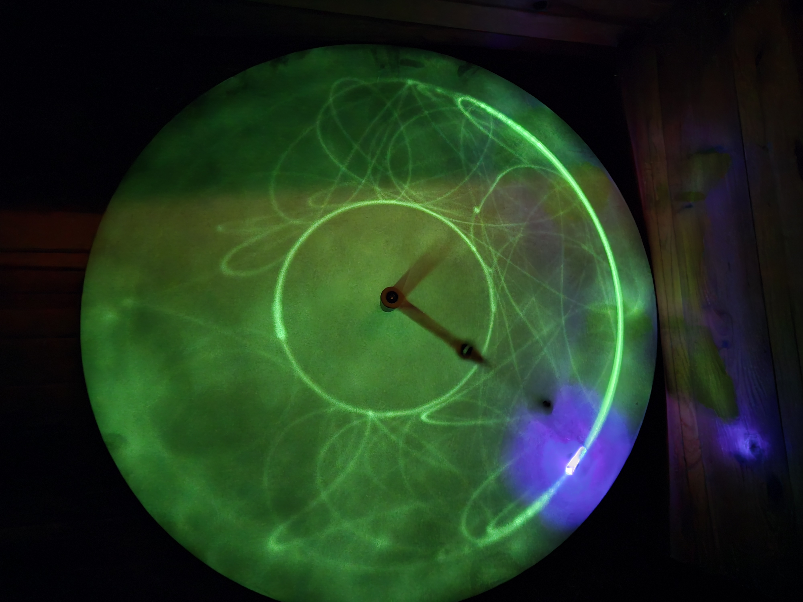

# Double Pendulum

## Objective
The Double Pendulum Model demonstrates the principles of chaotic motion and nonlinear dynamics in physics. With two connected swinging arms, the system exhibits unpredictable and highly sensitive movement patterns, where even the smallest variations in starting conditions lead to vastly different outcomes. This model provides a hands-on way to explore the concepts of angular momentum, energy conservation, and chaos theory, offering a striking example of how deterministic systems can behave in seemingly random ways.

---
[Return to all exhibits](../README.md)
