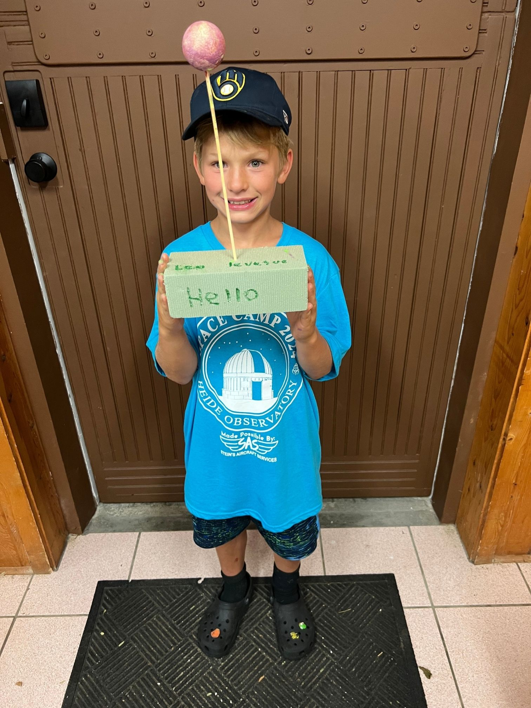
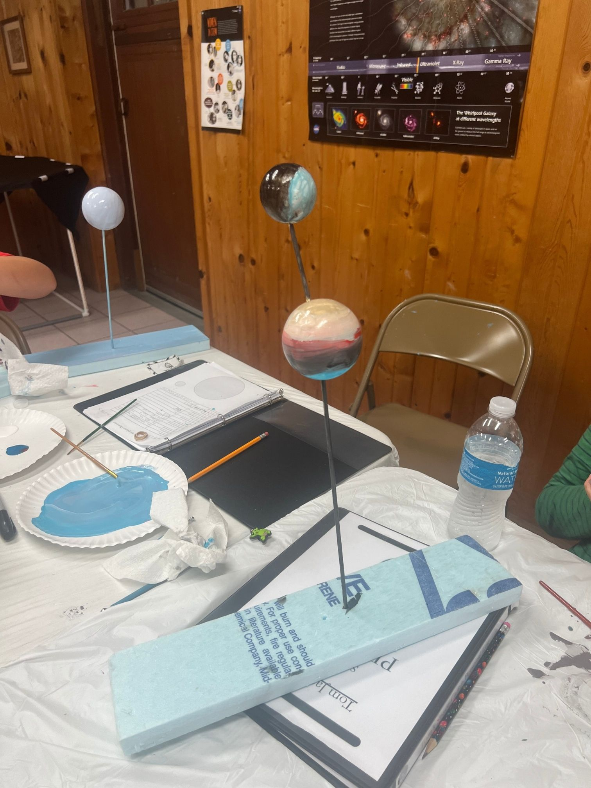

# Exoplanet Creations

## Objective
Students will design their own exoplanets by filling out a detailed worksheet describing their planet’s characteristics. After discussing their ideas, they will create a 3D model of their planet using foam balls and paint, reinforcing concepts of planetary science and creativity in exoplanet formation.

---
[Return to all exhibits](../README.md)
