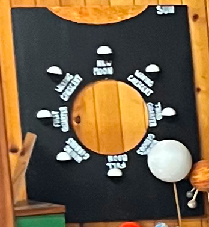

# Moon Phases

## Objective
Participants experience the connection between the perceived phase of the moon and the orientation of the lit side of 
the Moon to the Sun and Earth. They also learn or review the names of the major phases.

---
[Return to all exhibits](../README.md)
