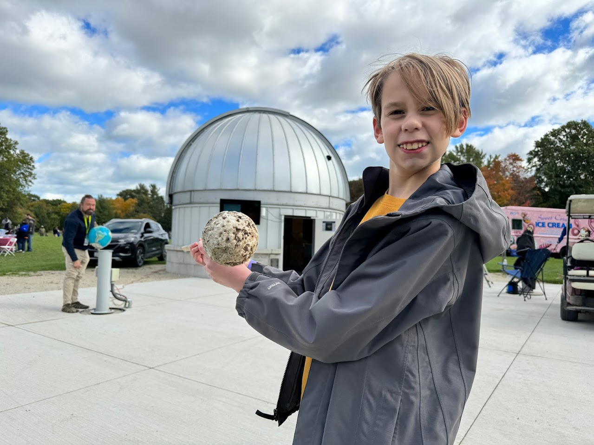

# Moon Scale

## Objective
Students will gain a better understanding of the size and distance relationship between the Earth and Moon, as well as the challenge of conceptualizing scale models of celestial objects.

---
[Return to all exhibits](../README.md)
