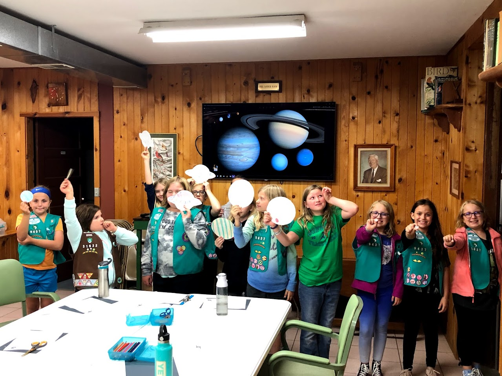

# Planet Diameter Scale Model

## Objective
Participants will explore the relative sizes and appearances of the planets by cutting out scaled circles and coloring them based on reference images, reinforcing their understanding of planetary scale and visual characteristics.