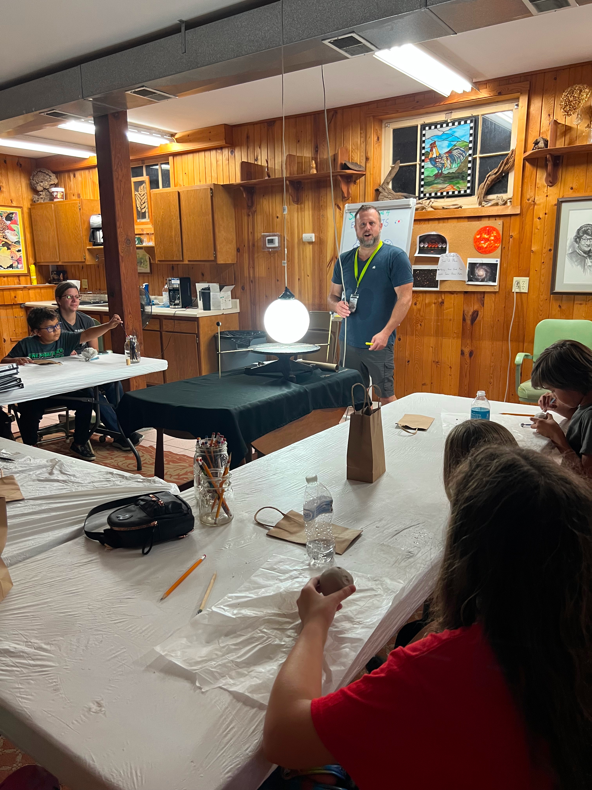

# Planetary Transit Model

## Objective
Using dark balls mounted to a rotating platform around a central lamp, participants can experience the transit of an
opaque body in front of a luminous one and by experience understand how planetary transits occur both in our solar 
system and around other stars to identify the existence of exoplanets. 

---
[Return to all exhibits](../README.md)
