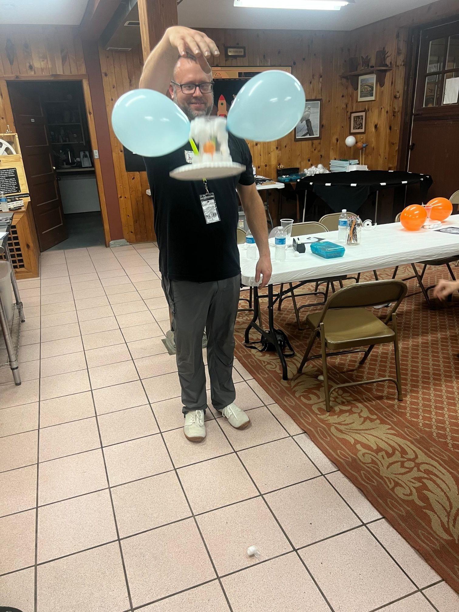

# Mission Lander

## Objective
Students will design and build a landing craft using limited materials to safely transport two "astronauts" (ping pong balls) to the ground without them bouncing or falling out of the cup. This activity introduces concepts of impact forces, cushioning, and stability in spacecraft landings.
