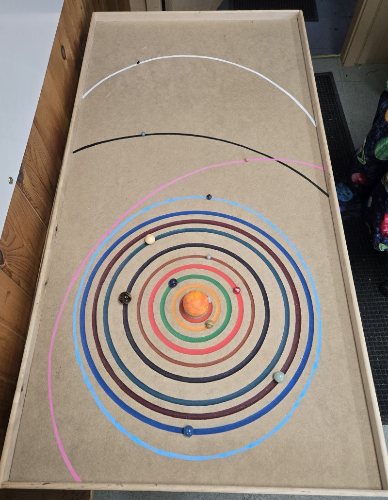

# Solar System Marble Table

## Objective
The Solar System Marble Table Model is designed to provide a tangible, scaled representation of planetary distances and sizes, helping visitors grasp the vastness of space in an interactive way. Using marbles of varying sizes to represent planets and carefully measured distances, this model visually demonstrates the immense scale differences between celestial bodies and their orbits around the Sun. By engaging with the model, learners can develop a deeper appreciation for the structure of our solar system, reinforcing key concepts in astronomy through hands-on exploration.

